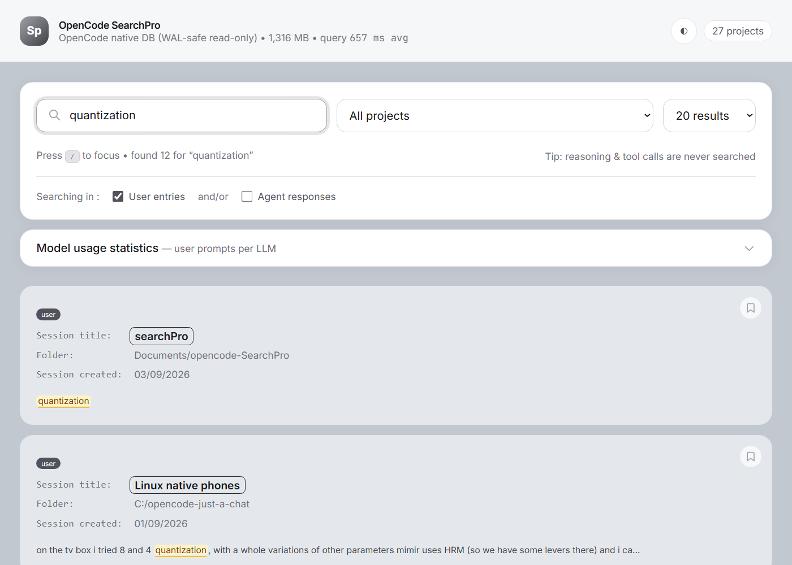
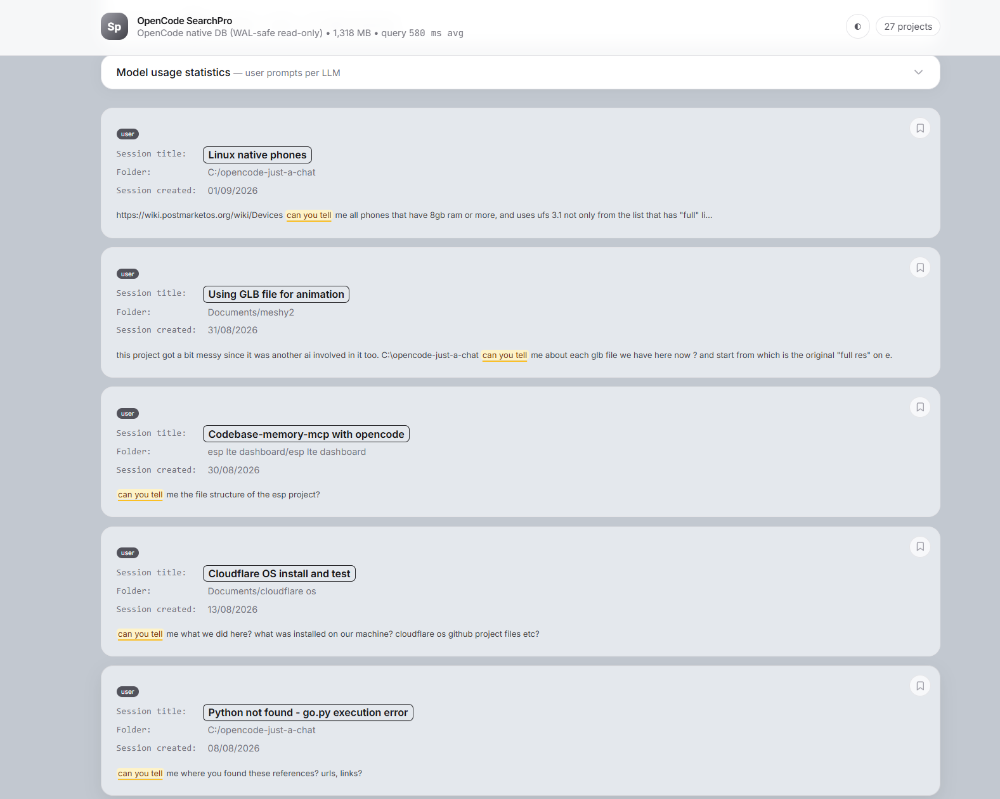

# OpenCode SearchPro

Full-text search over your [opencode](https://github.com/anomalyco/opencode) history — user prompts *and* agent responses — in a fast local web UI. No accounts, no cloud, no dependencies beyond Python itself.



> Unofficial community project. Not affiliated with the opencode team.



## Why

OpenCode's Home search only matches auto-generated session titles. You wont find anything of a sessions actual content.

SearchPro queries the actual message content in opencode's local SQLite database, so you can find "that thing about rate limiting from last Tuesday" by its words.

## Features

- **Search everything** — user prompts and agent responses, with per-role toggles
- **Live results** — every keystroke re-reads the DB (WAL-aware read-only; never writes, never locks)
- **Result cards** — session title, working folder, creation date, keyword highlighting with hover-for-context popups
- **Bookmarks** — pin hits to the top, persisted in the browser
- **Model usage statistics** — collapsible per-LLM breakdown of your prompt counts
- **Dark mode** — follows your system, toggleable, remembered
- **Zero dependencies** — Python standard library only; UI via CDN Tailwind

## Install

Prerequisites: [git](https://git-scm.com), Python 3.10+, and opencode
(any recent version) with its local database.

```powershell
# Windows (PowerShell) — open any folder, e.g. Documents
cd ~\Documents
git clone https://github.com/oskar-labs/opencode-searchPro.git
cd opencode-searchPro
python web.py
# open http://127.0.0.1:8765  (or double-click start-web.bat)
```

```sh
# macOS / Linux
git clone https://github.com/oskar-labs/opencode-searchPro.git
cd opencode-searchPro
./start-web.sh   # chmod +x start-web.sh first if needed
```

```powershell
# CLI (all platforms)
python search.py "rate limit" --limit 20
python search.py --all --limit 20
python search.py "docker" --project "my-app" --json
```

To resume a session: note its **working folder + title**, then `Ctrl+B` in opencode Desktop
and open it by title. (Session IDs are not searchable inside opencode.)

## Configuration

| Source | Value |
|---|---|
| `--db PATH` (CLI) | explicit database path |
| `$OPENCODE_DB` | explicit database path (CLI + web) |
| default | `~/.local/share/opencode/opencode.db` |

## How it works

opencode stores sessions in SQLite: `session` → `message` (JSON, `role`) → `part`
(JSON, `type`). Prompts are `role = "user" AND type = "text"`; replies are
`role = "assistant" AND type = "text"`. Everything else (reasoning, tool calls,
step markers) is excluded from search.

Reads open the DB as `file:...?mode=ro` — read-only, WAL-aware, safe while the
Desktop app is running and writing. (Lesson learned the hard way: `immutable=1`
pins reads to the last checkpoint and hides the freshest messages.)

## License

MIT — see [LICENSE](LICENSE).
